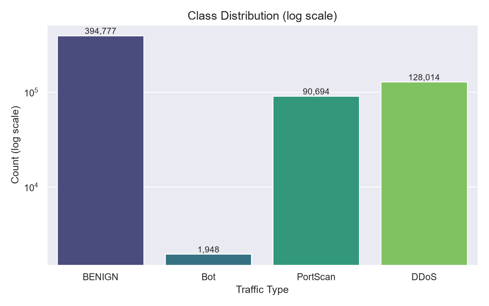
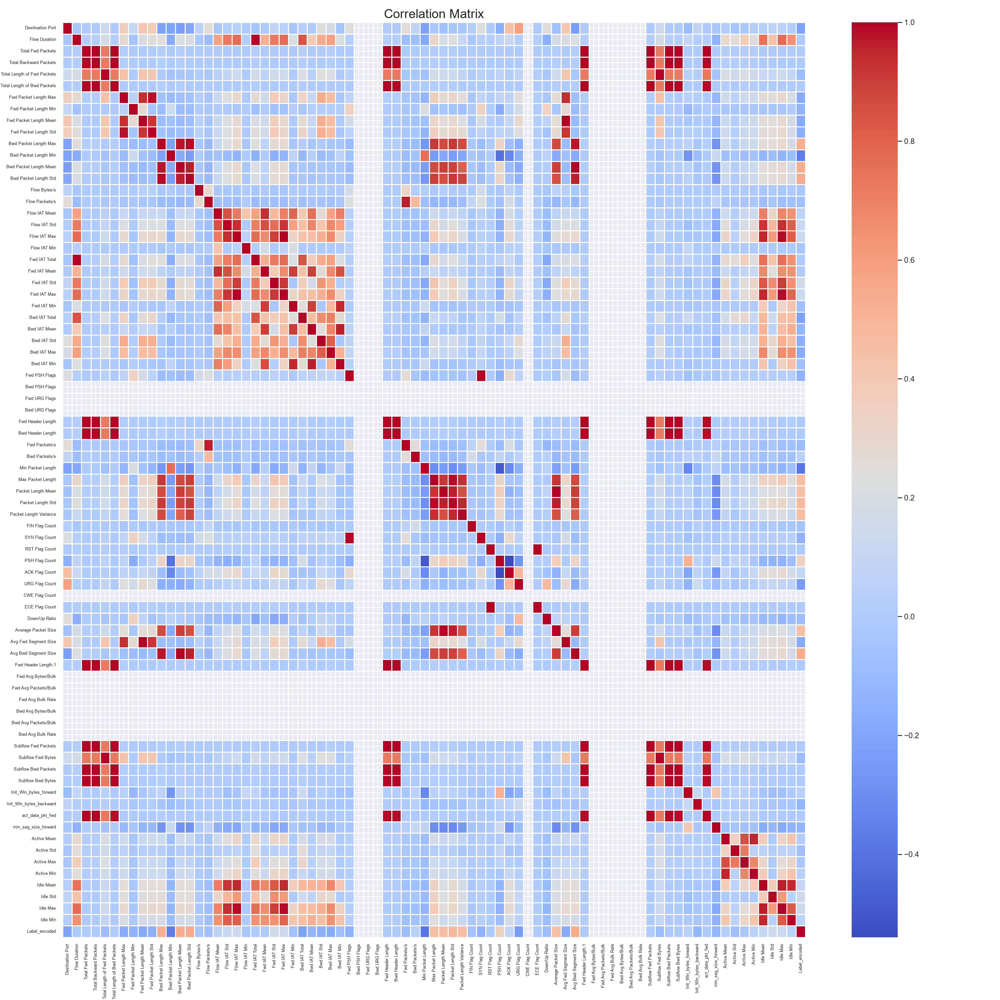
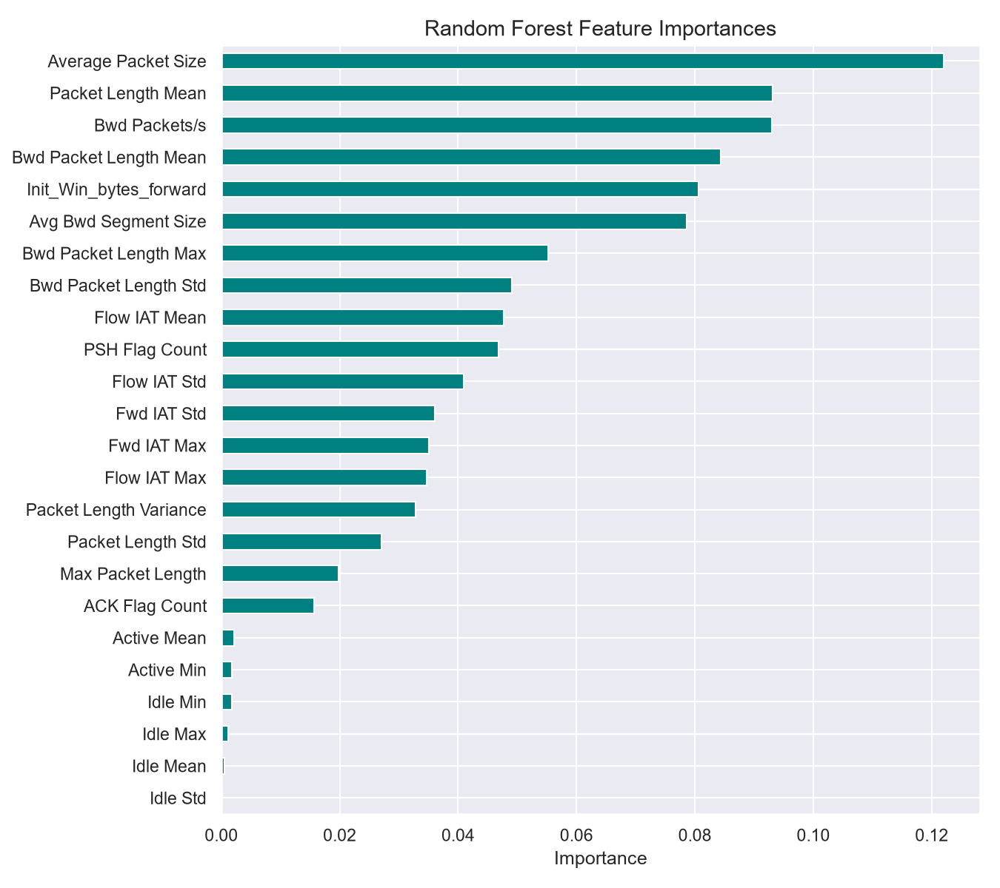
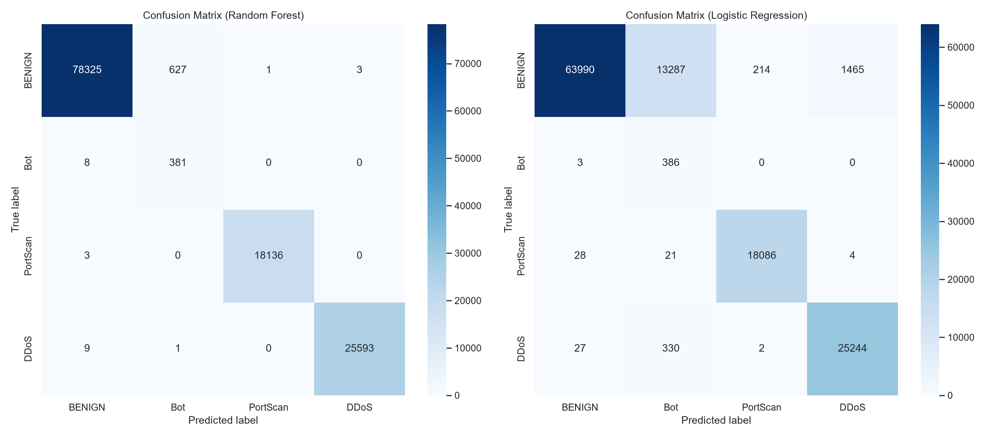
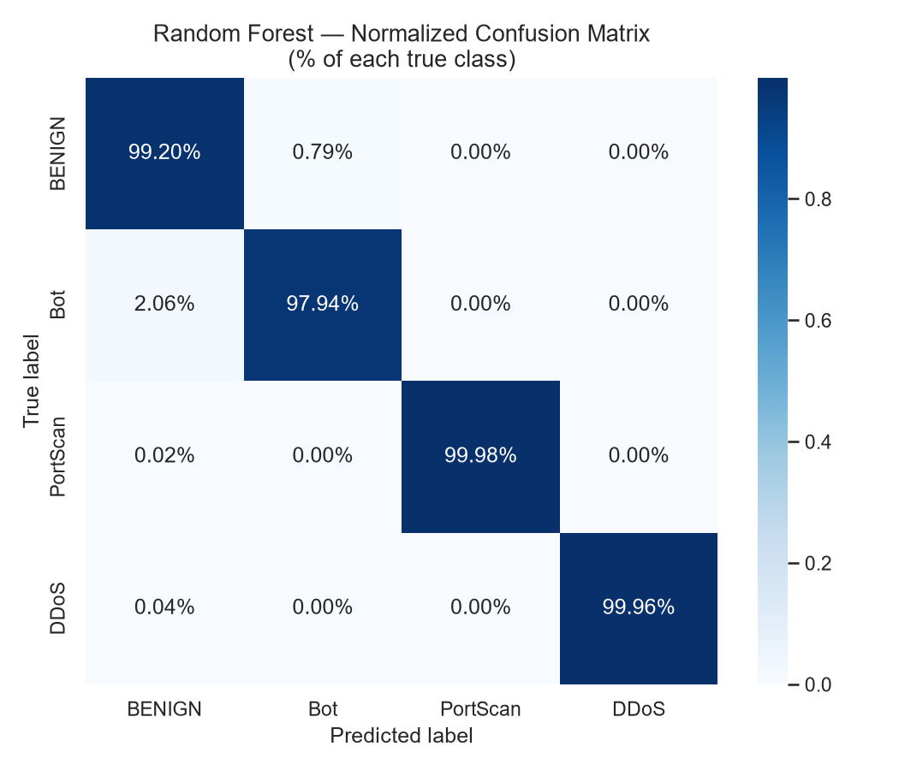
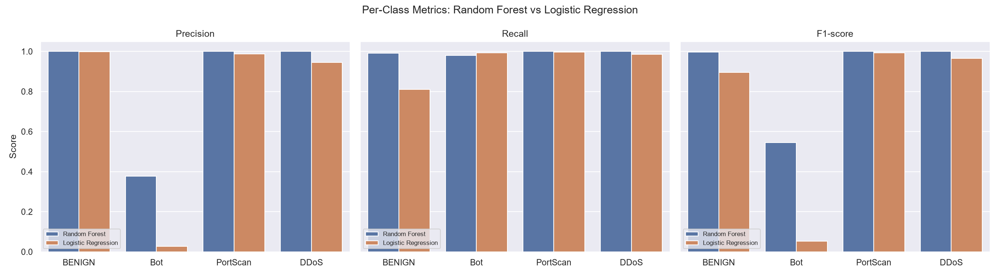

# AI Intrusion Detection

This is a machine learning project I built to better understand how ML can be used in cybersecurity. The goal is to classify network traffic as benign or as a specific type of attack using the CICIDS2017 dataset.

The project covers the main steps of a machine learning workflow: cleaning the data, choosing useful features, training different models, and evaluating the results with classification metrics.

## Dataset

This project uses the CICIDS2017 dataset, created by the Canadian Institute for Cybersecurity at the University of New Brunswick.

I am using the Friday files, which contain normal network traffic along with these attack types:

- Botnet activity
- PortScan
- DDoS

The dataset contains flow-based network features, such as packet counts, byte counts, flow duration, and ports. These features help the model learn patterns that separate normal behavior from malicious activity.

For example, a high number of flow bytes or packets in a short duration going to the same destination could indicate flooding behavior, which is often associated with DDoS attacks.

## Why I Am Building This

I wanted a project that combines machine learning with cybersecurity because both areas interest me. Intrusion detection is a good problem to study because it is not just about getting a high accuracy score. The model also needs to correctly catch harmful traffic, even when attacks are rare compared to normal traffic.

## Tools and Technologies

- Python
- pandas
- NumPy
- scikit-learn
- matplotlib
- streamlit
- Git/GitHub

## Results

I trained two models, Logistic Regression as a simple baseline and Random Forest as a stronger nonlinear model, and compared them with the plots below.

### Class Distribution



This shows how many flows belong to each label. The classes are not balanced: [ex: "Bot has far fewer examples than BENIGN, DDoS, and PortScan"]. This matters because a model can score high accuracy just by predicting the common classes, so I focus on per-class precision and recall instead of accuracy alone.

### Feature Correlation



This heatmap shows how strongly the numeric features are correlated with each other. Many features are highly correlated  [ex: two related features, like forward packet counts and total packet counts], which means some of them carry redundant information.

### Feature Importance



These are the features the Random Forest relied on most. The top features were [top 3 features], which makes sense because [one-sentence reason, e.g. "port scans hit many destination ports with very small packets"].

### Confusion Matrices



A confusion matrix shows, for each true label, what the model predicted. Correct predictions fall on the diagonal, and mistakes fall everywhere else. [Describe the main difference, e.g. "Logistic Regression confused some Bot traffic with BENIGN, while Random Forest separated them almost perfectly."]

### Normalized Confusion Matrix



This version shows percentages instead of raw counts, so each row sums to 100%. It makes the smaller classes easier to judge, since their mistakes don't get hidden by the large classes. The diagonal values are each class's recall: the percentage of that traffic type the model correctly caught.

### Precision, Recall, and F1 Comparison



This compares both models on three metrics for each class:

- **Precision:** when the model flags traffic as an attack, how often it is right
- **Recall:** out of all real attacks, how many the model caught
- **F1 score:** a balance of precision and recall

[Summarize the result, e.g. "Random Forest outperformed Logistic Regression across every class, with the biggest gap on Bot, the rarest class."]

## How to Run

1. Download the Friday CSV files from the [CICIDS2017 dataset page](https://www.unb.ca/cic/datasets/ids-2017.html) and place them in the project folder.
2. Install the dependencies:
```
   pip install -r requirements.txt
```
3. Train the models:
```
   python ml_start.py
```
4. Generate the plots:
```
   python plots.py
```
5. [Describe app.py, e.g. "Launch the demo app with `streamlit run app.py`"]

The raw data and trained model files are not included in this repo because of their size. Running the scripts above recreates them.

## Next Steps

- [e.g. Handle class imbalance with class weights or resampling]
- [e.g. Test on other days of the CICIDS2017 dataset to check generalization]
- [e.g. Try additional models like XGBoost]

## Author

Sameer Shrivastava  
Computer Science & Data Science Student, Rutgers University–New Brunswick
